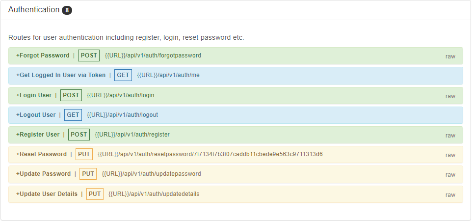

# DevCamper App (Backend)

Ecommerce App developed using Node.js and MongoDB. 

## Features

- New bootcamps can be added by the admin.
- New courses can be added corresponding to the bootcamp.
- Reviews can be added for each course enrolled by the user.
- All the user details can be viewed and edited by the admins.
- Authentication features such as register, login, reset password, update password, logout, etc are available

## Tech

This application uses a number of open source projects to work properly:

- [Node.js] -  Node.js is an open-source, cross-platform, back-end JavaScript runtime environment that runs on the V8 engine and executes JavaScript code outside a web browser.
- [MongoDB] - MongoDB is a source-available cross-platform document-oriented database program. Classified as a NoSQL database program, MongoDB uses JSON-like documents with optional schemas.

And of course this application itself is open source with every code available here in github.

## Installation

Requires [Node.js](https://nodejs.org/) v10+ to run.

Install the dependencies and start the server.

```sh
cd DevCamper
npm install
npm start
```

## Screenshot

##### Authentication


##### Bootcamps


##### Courses


##### Reviews


##### Users


## Development

Want to contribute? Great!


Open your favorite Terminal and run these commands.

Terminal:

```sh
cd DevCamper
npm run start
```

Make a change in your file and instantaneously see your updates!

## Hosted
The link for the finished website - [Click Here](https://positive-dazzling-watch.glitch.me/)

<!-- ## License

MIT -->
